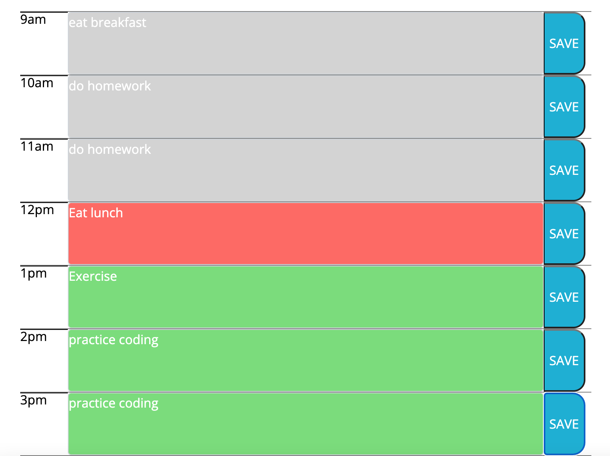

# Workday_Planner

## Description
This application is a simple planner app to schedule tasks in a 9-5 workday hour-by-hour. The text fields are color coded in real-time based on the time of day. The current hour is shown as red, future hours are green, and past hours are grey.

The application allows a user to save a task for each hour into local storage that will be persistent when the page reloads. Also, the current date will update at the top of the page upon opening the app. 

## Screnshot
Below is a screenshot demonstrating the app's functionality.

## Links to Application/Repo
link to deployed application:  
link to GitHub repository: https://github.com/dejuliusvince/Workday_Planner

